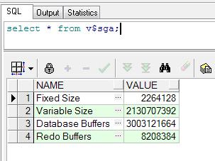

# 前言

这两天做一个数据库的查询,需要跨表空间

遇到了Oracle的基础知识,体系啥的.很迷茫.通过下面的连接,自己又总结了一下.

[参考文章地址](https://blog.csdn.net/wanghai__/article/details/4683983)

# ORACLE 实例

- System Global Area(SGA) 
- Background Process 


```sql
select * from v$sga;
```



# ORACLE 逻辑结构

## 表空间 table space
## 端 segment


