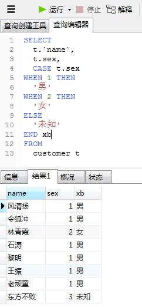
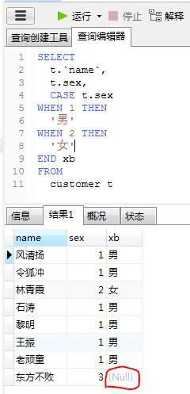
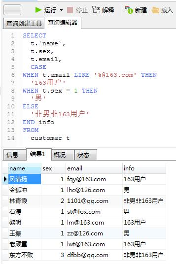
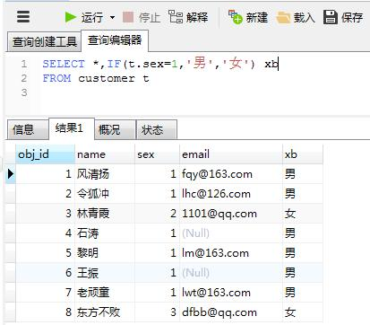
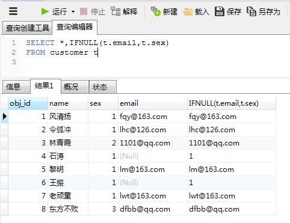

# mysql case

## 概要

在做判断时,case 是一种非常好用的方法

- 有匹配结果,返回结果值.
- 如果没有匹配的结果值，则返回结果为ELSE后的结果
- 如果没有ELSE 部分，则返回值为 `NULL`。

**记住,没有ELSE会返回 NULL**


整点数据测试一下
```sql
SET FOREIGN_KEY_CHECKS=0;
DROP TABLE IF EXISTS `customer`;
CREATE TABLE `customer` (
  `obj_id` int(11) NOT NULL AUTO_INCREMENT,
  `name` varchar(50) NOT NULL,
  `sex` tinyint(4) NOT NULL DEFAULT '1',
  `email` varchar(100) DEFAULT NULL,
  PRIMARY KEY (`obj_id`)
) ENGINE=InnoDB AUTO_INCREMENT=8 DEFAULT CHARSET=utf8;

INSERT INTO `customer` VALUES ('1', '风清扬', '1', 'fqy@163.com');
INSERT INTO `customer` VALUES ('2', '令狐冲', '1', 'lhc@126.com');
INSERT INTO `customer` VALUES ('3', '林青霞', '2', '1101@qq.com');
INSERT INTO `customer` VALUES ('4', '石涛', '1', null);
INSERT INTO `customer` VALUES ('5', '黎明', '1', 'lm@163.com');
INSERT INTO `customer` VALUES ('6', '王振', '1', null);
INSERT INTO `customer` VALUES ('7', '老顽童', '1', 'lwt@163.com');
INSERT INTO `customer` VALUES ('8', '东方不败', '3', 'dfbb@qq.com');
```

## case 的常见用法

### case 属性

- 对某个属性里的值进行判断
- sql 为了大家好,我就不贴出来了


需要注意
- case 后接 when 属性值 then 返回值
- when then 之间没有逗号
- ELSE 除非你确定返回NULL ,否则一定要写
- END 是必须放在最后的,而且后面可以接别名




---
曾经updat语句时,使用case忘记写ELSE,造成了许多数据成了NULL
一失足成千古恨,大家慎重慎重

没有写ELSE的返回结果



### case 条件

如果,你不仅想判断某一个属性,而是想判断多个属性的多个值
就需要 case 多个属性

注意

- 只要有一个条件符合就返回值了,不再判断了.



### update中使用

- set = ( case ... ) 这种形式
- 记住ELSE要写,或者加上 where条件


# IF 和 IFNULL

- IF 和 IFNULL 有时可以代替CASE.
- IF并不是SQL标准.不是所有数据库都能用
- IF在mysql的存贮过程中,有很强大的条件语句控制


## IF
>在MySQL中，0或 NULL意味着假,而其它值意味着真。布尔运算的默认真值是1。

- IF(EXPR1,EXPR2,EXPR3)
- EXPR(表达式1)成立,则返回EXPR2,否则返回EXPR3
- 类似三目运算




## IFNULL

- IFNULL(EXPR1,expr2)
- 如果EXPR1值为NULL,则输出EXPR2,不为空则输出EXPR1本身



[CASE](https://blog.csdn.net/qq_30038111/article/details/79611167)
[IF参考](https://blog.csdn.net/ahjxhy2010/article/details/71194413)
[IF-OR-CASE in procedure](http://outofmemory.cn/mysql/procedure/conditional-control-if-case-statement-stored-procedures)


