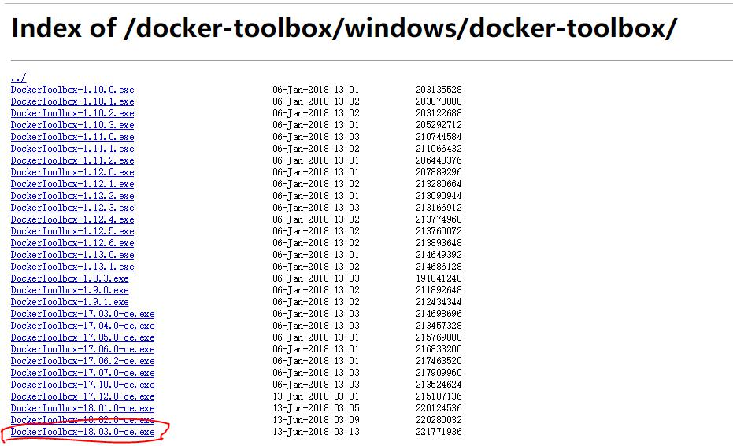
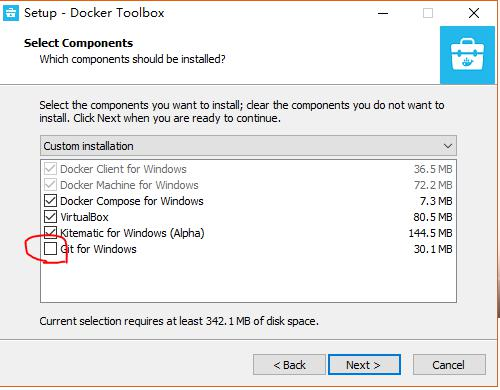
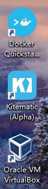
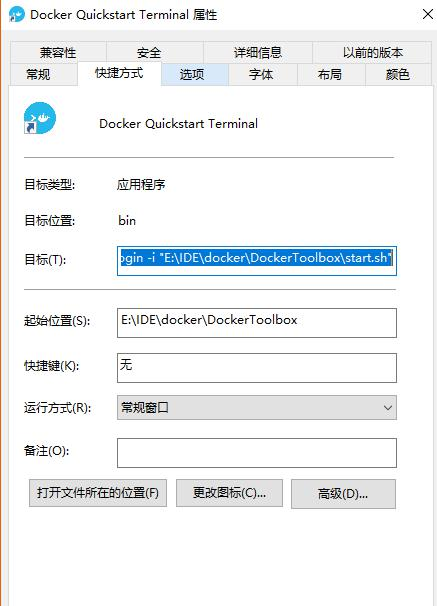
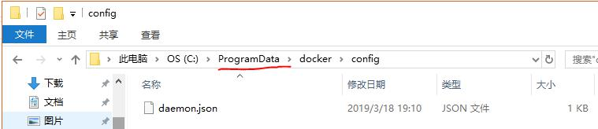
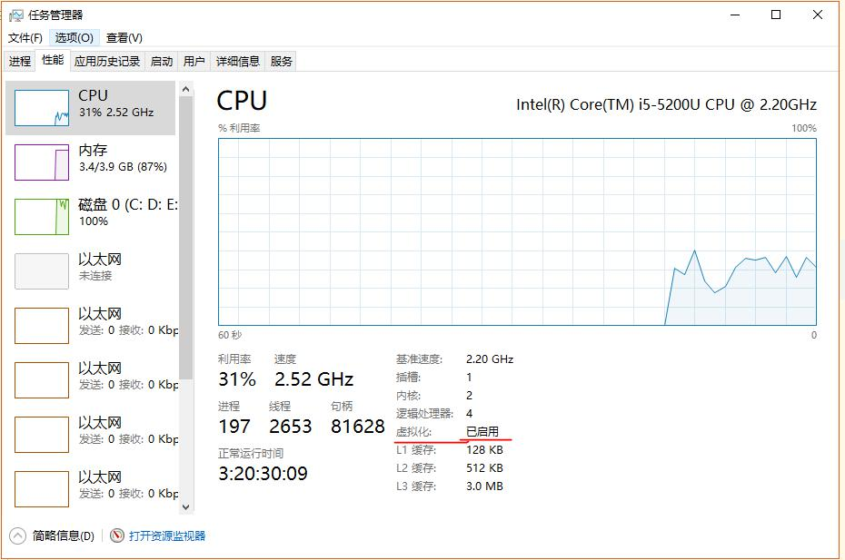
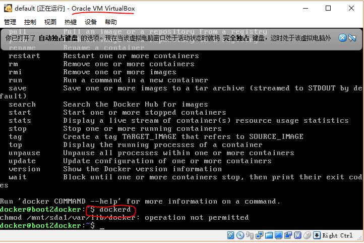

# win10 家庭版

## 简介

>win10下docker做一个简单的介绍,对理解很有帮助.

### linux下的docker

docker是基于linux内核(kernel)的一个容器,所以它是不能够在win10下运行的.

但是为了能够让win10用户能够使用,就必须先要有虚拟机.而装虚拟机的目的就是为了提供一个linux环境.
所以docker-toolbox才会默认带一个Oracle的virtual box的虚拟机软件.当然,win10专业版,有自带的虚拟机.

只有虚拟机是不行的,还有要iso的镜像,docker给我们准备了一个boot2docker.iso的镜像.(专门为docker使用的很小的一个镜像)

### docker-machine

如果只需要一个docker,其实是不需要知道docker-machine的.但是为了更好的了解win10下的docker,这里简单说一下.

docker-machine是对在win10下,通过虚拟机创建的一些docker进行管理.可以进行docker的新建,删除等等.对于需要多个docker的用户,
十分的实用.

docker-machine会在你运行 QuickStartTerminal时帮你创建一个default的docker

```
docker-machine ps
```


### docker

刚刚提到的docker-machine可以管理多个docker,但是具体的某一个docker还是运行在一个虚拟机上的.

当我们要进入某一个docker时,可以通过ssh直接进入.当然docker为我们提供了便利的登录方式,替我们生成了公私钥,并配置好了.

```
docker-machine ssh default
```

只有进入docker才能使用`dockerd`的命令

## 下载

建议去镜像下载

注意,个人使用下载社区版(以ce为后缀的)

[docker-mirrors-地址](http://mirrors.aliyun.com/docker-toolbox/windows/docker-toolbox/)



[官方安装文档](https://docs.docker-cn.com/docker-for-windows/install/#what-to-know-before-you-install)

[解释了安装的内容](https://docs.docker-cn.com/toolbox/toolbox_install_windows/#what-you-get-and-how-it-works)

## 安装时

如果自己电脑上安装了`git`就不要再选了



安装时,会向你请求一些权限,恩,肯定选同意

## 安装后

安装后,会有三个图标在桌面上




点击`Docker Quickstart Terminal`运行

---

如果你的git没有在`C:\Program Files\Git`的话,点击后会让你选择bash.exe,这个文件在Git\bin下面



需要把目标的引用改成你本地的bash.exe

```
E:\IDE\git\Git\bin\bash.exe --login -i "E:\IDE\docker\DockerToolbox\start.sh"
```

### boot2docker.iso 文件

如果在docker里面加载iso文件(boot2docker.iso)的话,会很慢.不如去github上下载,再放到
`C:\Users\ASUS\.docker\machine\cache` 里面

当然也可以修改一下配置文件(这个配置文件夹和文件**可能没有新建即可**)
另外ProgramData文件夹是隐藏的,选择查看隐藏文件即可



window 在 `%programdata%\docker\config\daemon.json` 里加入

`registry-mirrors`是docker镜像地址,graph是存放iso镜像的地址

## 配置

### CPU开启虚拟化

确定CPU开启了虚拟化,CPU的虚拟化功能在开机时进入BIOS中设置开启




### 配置镜像

- 命令修改
```
docker-machine ssh default
sudo sed -i "s|EXTRA_ARGS='|EXTRA_ARGS='--registry-mirror=https://registry.docker-cn.com |g" /var/lib/boot2docker/profile
exit
docker-machine restart default
```

或者通过配置文件修改

- 配置文件修改
```
sudo vi /var/lib/boot2docker/profile
```

修改为
```json
{
  "registry-mirrors": ["http://hub-mirror.c.163.com"]
}
```

[官方镜像说明](https://www.docker-cn.com/registry-mirror)


## 成功

成功之后会出现小鲸鱼


查看 docker的信息

```bash
docker info
```


参考文章

[windows-docker-install](http://www.runoob.com/docker/windows-docker-install.html)
[CPU虚拟化功能](https://blog.csdn.net/hao_kkkkk/article/details/79853752)
[docker下载镜像](https://blog.csdn.net/u013948858/article/details/80811986)


## dockerd



docker daemon 这个命令只能在linux下进行
- 在windows 下cmd是不行的所以,要在虚拟机中运行(virtual box)
- 或者通过docker-machine的ssh 连接到VM的主机

```
docker-machine ssh default
```


## mongo

1.下载：

```
docker pull mongo 
```

2.查看：（会看到自己下载的镜像）

```
docker images 
```

3.去创建一个docker卷 ：

```
docker volume create mongodata
```

4.查看一下你的卷路径（确保创建成功）：

```
docker volume inspect mongodata
```

如果成功会出现以下内容：

```json
[
    {
        "CreatedAt": "2019-02-28T09:12:08Z",
        "Driver": "local",
        "Labels": {},
        "Mountpoint": "/mnt/sda1/var/lib/docker/volumes/mongodata/_data",
        "Name": "mongodata",
        "Options": {},
        "Scope": "local"
    }
]
```


5.这个时候就可以运行

```
docker run --name mongo -p 27017:27017 -v mongodata:/data/db -e MONGO_INITDB_ROOT_USERNAME=root -e MONGO_INITDB_ROOT_PASSWORD=root -d mongo
```

结果：

```
1500417691d8f0ea71c2ddbe589f27e2b38cbf92e5fcece6683e5bf47e8cdf0c
```

6.确认一下是否启动：

```
docker ps
```

结果：

```
CONTAINER ID IMAGE COMMAND CREATED
     STATUS PORTS NAMES
1500417691d8 mongo "docker-entrypoint.s" 10 minutes ago
    Up 10 minutes 0.0.0.0:27017->27017/tcp mongo
```
