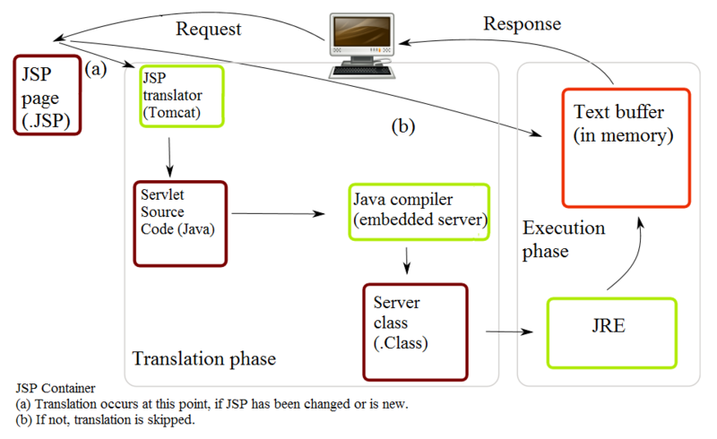

# servlet

[wiki-servlet](https://en.wikipedia.org/wiki/Java_servlet)

## 执行流程

1. 假设一个用户通过URL请求
	- 浏览器会为这个URL生成一个HTTP请求
	- 这个请求被发送到相应的服务器
2. HTTP请求通过web服务器接收,并转发到servlet容器中
	- 容器将请求映射到对应的servlet中
	- servlet动态地检索并加载到容器的地址空间
3. 容器调用servlet的`init()`方法
	- `init()`方法只当servlet第一次加载到内存中时被调用
	- 可以将初始化参数传递给servlet，以便它可以配置自己
4. 容器调用servlet的`service()`方法
	- `service()`方法会处理HTTP请求
	- servlet可以读取HTTP请求提供的参数
	- servlet可以明确的表达一个HTTP响应给客户端
5. servlet保持在容器中的地址空间并且对从其它客户端的HTTP请求进行处理
	- `service()`方法在每一次HTTP请求时被调用
6. 容器在某种程度上可以决定从内存中是否加载
	- 算法取决于不同的容器
7. 容器调用`destory()`方法来放弃所有诸如 file handles的被分配的资源.重要的数据可以被永久保存.
8. 分配给servlet的内存以及对象随后被垃圾回收掉
