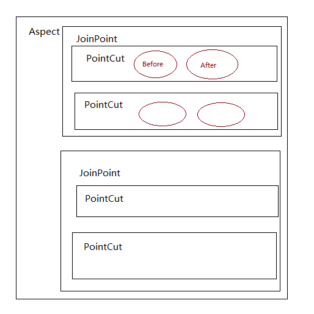

## 内容说明

原文内容总结自spring官网,
代码部分是原创,需要了解更多的内容,可以去官网查阅.

[spring-framework-reference/core](https://docs.spring.io/spring/docs/5.1.5.RELEASE/spring-framework-reference/core.html#aop-understanding-aop-proxies)

文档版本 spring 5.1.5.RELEASE


## AOP 目的

spring 

- 提供声明式的企业服务,尤其是替换EJB声明式服务.例如声明式的事务管理.
- 让用户实现自定义的`Aspect`,满足对AOP的需要

下面的内容来自

[Spring(4)——面向切面编程（AOP模块）](https://www.jianshu.com/p/994027425b44)


AOP 即 Aspect Oriented Program 面向切面编程
首先，在面向切面编程的思想里面，把功能分为核心业务功能，和周边功能。

- 核心业务，比如登陆，增加数据，删除数据都叫核心业务

- 周边功能，比如性能统计，日志，事务管理等等

周边功能在 Spring 的面向切面编程AOP思想里，即被定义为切面
在面向切面编程AOP的思想里面，核心业务功能和切面功能分别独立进行开发，然后把切面功能和核心业务功能 "编织" 在一起，这就叫AOP

AOP能够将那些与业务无关，却为业务模块所共同调用的逻辑或责任（例如事务处理、日志管理、权限控制等）封装起来，便于减少系统的重复代码，降低模块间的耦合度，并有利于未来的可拓展性和可维护性。


## AOP 术语

下面会介绍几个AOP的术语,这部分并非spring特有的.而是AspectJ相关内容.

这些术语会有些绕圈,但是不用慌,结合最后的例子会有更多了解.这里大家先了解一下就好.

- `Aspect` 

切面,就是将原有的方法进行拦截,然后进行一系列的操作的过程.它包括了找到`Pointcut`,加入`Advice`

- `Join point` 

一个程序的执行点,例如一个异常的处理,一个`Join point` 展示了方法的执行.

- `Pointcut`

可以对`Join point` 进行限定.限定哪些方法执行哪些`Advice`.我把它理解为形容词,加上`Pointcut`的`Join point` 才能变成我们想要方法.

举个例子: `Join point` 就好比女人吧,我们要找媳妇,可不能就只是女人就行吧. 这是`Pointcut`就像是形容词一样来匹配不同的女人.

如果`Pointcut`是美丽的,那么被`Pointcut`的`Join point`就是 美丽的女人了.


- `Advice`

在`Join point`中,具体做的那些内容叫做`Advice`.也就是告诉spring,我想要加入什么内容.

而`Advice`有不同的应用场景.有around, before 和 after.下文会讲述.
spring中将`Advice`建模为拦截器，并围绕`Join point`维护拦截器链。

- `Weaving`

把`Aspect`与其它的对象链接,达到增强原有方法的目的.spring中在运行时进行.当然具体将`Aspect`运用到需要的地方,这个是spring替我们做了.


所谓一图顶千言.我简单画一个图,仅供参考



`joinpoint` 和 `pointcut` 有点混的话,可以参考下面的内容

[spring-aop-whats-the-difference-between-joinpoint-and-pointcut](https://stackoverflow.com/questions/15447397/spring-aop-whats-the-difference-between-joinpoint-and-pointcut)


### AOP suggestion


`Around`类型的`Advice`是使用广泛的`Advice`,也是功能最强大的.但是spring建议,尽量使用小范围的`Advice`去实现必要的功能.

例如,你仅仅想缓存一个更新后的值,那你只需要一个`After`的`Advice`就可以了.这样会减少你犯错的可能.否者,你可能会忘记调用`proceed()`方法.

Spring AOP 现在只支持对方法的拦截,而不会对字段进行拦截.


## spring AOP

Spring AOP defaults to using standard JDK dynamic proxies for AOP proxies. This enables any interface (or set of interfaces) to be proxied.

Spring AOP can also use CGLIB proxies. This is necessary to proxy classes rather than interfaces. By default, CGLIB is used if a business object does not implement an interface. As it is good practice to program to interfaces rather than classes, business classes normally implement one or more business interfaces. It is possible to force the use of CGLIB, in those (hopefully rare) cases where you need to advise a method that is not declared on an interface or where you need to pass a proxied object to a method as a concrete type.

It is important to grasp the fact that Spring AOP is proxy-based. See Understanding AOP Proxies for a thorough examination of exactly what this implementation detail actually means.

###  self-invocation

The key thing to understand here is that the client code inside the main(..) method of the Main class has a reference to the proxy. This means that method calls on that object reference are calls on the proxy. As a result, the proxy can delegate to all of the interceptors (advice) that are relevant to that particular method call. 

However, once the call has finally reached the target object (the SimplePojo, reference in this case), any method calls that it may make on itself, such as this.bar() or this.foo(), are going to be invoked against the this reference, and not the proxy. This has important implications. It means that self-invocation is not going to result in the advice associated with a method invocation getting a chance to execute.


## @AspectJ support

开启 AspectJAutoProxy

- Java配置

```java
@Configuration
@EnableAspectJAutoProxy
public class AppConfig {

}
```

- xml配置

```xml
<aop:aspectj-autoproxy/>
```


### @Aspect 

定义一个Aspect

```xml
<bean id="myAspect" class="org.xyz.NotVeryUsefulAspect">
    <!-- configure properties of the aspect here -->
</bean>

```


```
package org.xyz;
import org.aspectj.lang.annotation.Aspect;

@Aspect
public class NotVeryUsefulAspect {

}
```


Aspects (classes annotated with @Aspect) can have methods and fields, the same as any other class. They can also contain pointcut, advice, and introduction (inter-type) declarations.

#### 注意

- @Aspect  不能让`NotVeryUsefulAspect`成为一个 bean,如果不想在xml中配置,可以加上`@Component`注解,使之成为一个bean

```java
@Component
@Aspect
public class NotVeryUsefulAspect {

}
```

- In Spring AOP, aspects themselves cannot be the targets of advice from other aspects. The @Aspect annotation on a class marks it as an aspect and, hence, excludes it from auto-proxying.

### @Pointcut

Pointcuts determine join points of interest and thus enable us to control when advice executes. 
Spring AOP only supports method execution join points for Spring beans, so you can think of a pointcut as matching the 
execution of methods on Spring beans. A pointcut declaration has two parts: a signature comprising a name and 
any parameters and a pointcut expression that determines exactly which method executions we are interested in.
 
 In the @AspectJ annotation-style of AOP, a pointcut signature is provided by a regular method definition, 
 and the pointcut expression is indicated by using the @Pointcut annotation (the method serving as the pointcut signature 
 must have a `void` return type).

`@Pointcut` 注解标记的方法,返回类型必须是	`void`	

```java
@Pointcut("execution(* transfer(..))")// the pointcut expression
private void anyOldTransfer() {}// the pointcut signature
```


Due to the proxy-based nature of Spring’s AOP framework, calls within the target object are, by definition, not intercepted. For JDK proxies, only public interface method calls on the proxy can be intercepted. With CGLIB, public and protected method calls on the proxy are intercepted (and even package-visible methods, if necessary). However, common interactions through proxies should always be designed through public signatures.


```
@Pointcut("execution(public * *(..))")
private void anyPublicOperation() {} 

@Pointcut("within(com.xyz.someapp.trading..*)")
private void inTrading() {} 

@Pointcut("anyPublicOperation() && inTrading()")
private void tradingOperation() {}
```


- `execution`: For matching method execution join points. This is the primary pointcut designator to use when working with Spring AOP.

- `within`: Limits matching to join points within certain types (the execution of a method declared within a matching type when using Spring AOP).


```java
package com.xyz.someapp;

import org.aspectj.lang.annotation.Aspect;
import org.aspectj.lang.annotation.Pointcut;

@Aspect
public class SystemArchitecture {

    /**
     * A join point is in the web layer if the method is defined
     * in a type in the com.xyz.someapp.web package or any sub-package
     * under that.
     */
    @Pointcut("within(com.xyz.someapp.web..*)")
    public void inWebLayer() {}

    /**
     * A join point is in the service layer if the method is defined
     * in a type in the com.xyz.someapp.service package or any sub-package
     * under that.
     */
    @Pointcut("within(com.xyz.someapp.service..*)")
    public void inServiceLayer() {}

    /**
     * A join point is in the data access layer if the method is defined
     * in a type in the com.xyz.someapp.dao package or any sub-package
     * under that.
     */
    @Pointcut("within(com.xyz.someapp.dao..*)")
    public void inDataAccessLayer() {}

    /**
     * A business service is the execution of any method defined on a service
     * interface. This definition assumes that interfaces are placed in the
     * "service" package, and that implementation types are in sub-packages.
     *
     * If you group service interfaces by functional area (for example,
     * in packages com.xyz.someapp.abc.service and com.xyz.someapp.def.service) then
     * the pointcut expression "execution(* com.xyz.someapp..service.*.*(..))"
     * could be used instead.
     *
     * Alternatively, you can write the expression using the 'bean'
     * PCD, like so "bean(*Service)". (This assumes that you have
     * named your Spring service beans in a consistent fashion.)
     */
    @Pointcut("execution(* com.xyz.someapp..service.*.*(..))")
    public void businessService() {}

    /**
     * A data access operation is the execution of any method defined on a
     * dao interface. This definition assumes that interfaces are placed in the
     * "dao" package, and that implementation types are in sub-packages.
     */
    @Pointcut("execution(* com.xyz.someapp.dao.*.*(..))")
    public void dataAccessOperation() {}

}
```


execution的格式


```java
execution(modifiers-pattern? ret-type-pattern declaring-type-pattern?name-pattern(param-pattern)
            throws-pattern?)
```


```java
execution(方法修饰符? 返回类型 声明类型?名字(参数)
            throws 异常?)
```

param-pattern

- `*` 代表任意字符(和正则差不多)
- `.` 代表一个任意类型
- `..` 代表多个任意类型


```
execution(public * *(..))

execution(* set*(..))

execution(* com.xyz.service.AccountService.*(..))

execution(* com.xyz.service.*.*(..))

execution(* com.xyz.service..*.*(..))

within(com.xyz.service.*)

within(com.xyz.service..*)
```


## Advice

### @Before

```java
import org.aspectj.lang.annotation.Aspect;
import org.aspectj.lang.annotation.Before;

@Aspect
public class BeforeExample {

    @Before("com.xyz.myapp.SystemArchitecture.dataAccessOperation()")
    public void doAccessCheck() {
        // ...
    }

}
```


```java
import org.aspectj.lang.annotation.Aspect;
import org.aspectj.lang.annotation.Before;

@Aspect
public class BeforeExample {

    @Before("execution(* com.xyz.myapp.dao.*.*(..))")
    public void doAccessCheck() {
        // ...
    }

}
```


### @AfterReturning

```java
import org.aspectj.lang.annotation.Aspect;
import org.aspectj.lang.annotation.AfterReturning;

@Aspect
public class AfterReturningExample {

    @AfterReturning("com.xyz.myapp.SystemArchitecture.dataAccessOperation()")
    public void doAccessCheck() {
        // ...
    }

}
```


```java
import org.aspectj.lang.annotation.Aspect;
import org.aspectj.lang.annotation.AfterReturning;

@Aspect
public class AfterReturningExample {

    @AfterReturning(
        pointcut="com.xyz.myapp.SystemArchitecture.dataAccessOperation()",
        returning="retVal")
    public void doAccessCheck(Object retVal) {
        // ...
    }

}
```


### @AfterThrowing 

```java
import org.aspectj.lang.annotation.Aspect;
import org.aspectj.lang.annotation.AfterThrowing;

@Aspect
public class AfterThrowingExample {

    @AfterThrowing("com.xyz.myapp.SystemArchitecture.dataAccessOperation()")
    public void doRecoveryActions() {
        // ...
    }

}

```


可以指定更加细致的异常处理

```java
import org.aspectj.lang.annotation.Aspect;
import org.aspectj.lang.annotation.AfterThrowing;

@Aspect
public class AfterThrowingExample {

    @AfterThrowing(
        pointcut="com.xyz.myapp.SystemArchitecture.dataAccessOperation()",
        throwing="ex")
    public void doRecoveryActions(DataAccessException ex) {
        // ...
    }

}
```


### @After

被`@After`修饰的方法,无论正常结束,还是抛出异常都会执行的.

```
import org.aspectj.lang.annotation.Aspect;
import org.aspectj.lang.annotation.After;

@Aspect
public class AfterFinallyExample {

    @After("com.xyz.myapp.SystemArchitecture.dataAccessOperation()")
    public void doReleaseLock() {
        // ...
    }

}
```


### @Around

#### 建议

The last kind of advice is around advice. Around advice runs “around” a matched method’s execution. It has the opportunity to do work both before and after the method executes and to determine when, how, and even if the method actually gets to execute at all. Around advice is often used if you need to share state before and after a method execution in a thread-safe manner (starting and stopping a timer, for example). Always use the least powerful form of advice that meets your requirements (that is, do not use around advice if before advice would do).

 @Around 这个Advice 功能强大,可以做before和after Advice的所有功能,甚至可以觉得所代理的方法执不执行.但是,要记住虽然功能强大,但是也容易
 出问题.所以建议尽量使用较小范围的Advice.
 
 
#### 注意
 
- `@Around` 标记的方法需要有返回类型
 
之前像`@Before`之类的注解都不会对整个方法有关键性的影响,只会在执行前后有一些其它内容的执行,不会影响到真正的方法执行.
也就说,之前的Advice是不能也不应该对代理方法进行返回类型的改变的.
 
但是 `@Around` 功能太强大了,可以说是对所代理的方法进行了彻底的改变.甚至返回类型都能改变.这也就是为什么说,spring建议尽可能地使用小范围的
Advice
 
```
import org.aspectj.lang.annotation.Aspect;
import org.aspectj.lang.annotation.Around;
import org.aspectj.lang.ProceedingJoinPoint;

@Aspect
public class AroundExample {

    @Around("com.xyz.myapp.SystemArchitecture.businessService()")
    public Object doBasicProfiling(ProceedingJoinPoint pjp) throws Throwable {
        // start stopwatch
        Object retVal = pjp.proceed();
        // stop stopwatch
        return retVal;
    }

}
```


## example

```java
@Aspect
public class ConcurrentOperationExecutor implements Ordered {

    private static final int DEFAULT_MAX_RETRIES = 2;

    private int maxRetries = DEFAULT_MAX_RETRIES;
    private int order = 1;

    public void setMaxRetries(int maxRetries) {
        this.maxRetries = maxRetries;
    }

    public int getOrder() {
        return this.order;
    }

    public void setOrder(int order) {
        this.order = order;
    }

    @Around("com.xyz.myapp.SystemArchitecture.businessService()")
    public Object doConcurrentOperation(ProceedingJoinPoint pjp) throws Throwable {
        int numAttempts = 0;
        PessimisticLockingFailureException lockFailureException;
        do {
            numAttempts++;
            try {
                return pjp.proceed();
            }
            catch(PessimisticLockingFailureException ex) {
                lockFailureException = ex;
            }
        } while(numAttempts <= this.maxRetries);
        throw lockFailureException;
    }

}
```

```java
@Aspect
public class ProfilingAspect {

    @Around("methodsToBeProfiled()")
    public Object profile(ProceedingJoinPoint pjp) throws Throwable {
        StopWatch sw = new StopWatch(getClass().getSimpleName());
        try {
            sw.start(pjp.getSignature().getName());
            return pjp.proceed();
        } finally {
            sw.stop();
            System.out.println(sw.prettyPrint());
        }
    }

    @Pointcut("execution(public * foo..*.*(..))")
    public void methodsToBeProfiled(){}
}
```

在`Pointcut` 并不是必须的,可以在`@Around`中写明`类全名+方法名` 但是这样一旦要处理的Advice多了就显得麻烦了

最好定义一个`@Pointcut`


### Proxying Mechanisms
Spring AOP uses either JDK dynamic proxies or CGLIB to create the proxy for a given target object. (JDK dynamic proxies are preferred whenever you have a choice).

If the target object to be proxied implements at least one interface, a JDK dynamic proxy is used. All of the interfaces implemented by the target type are proxied. If the target object does not implement any interfaces, a CGLIB proxy is created.

If you want to force the use of CGLIB proxying (for example, to proxy every method defined for the target object, not only those implemented by its interfaces), you can do so. However, you should consider the following issues:

final methods cannot be advised, as they cannot be overridden.

As of Spring 3.2, it is no longer necessary to add CGLIB to your project classpath, as CGLIB classes are repackaged under org.springframework and included directly in the spring-core JAR. This means that CGLIB-based proxy support “just works”, in the same way that JDK dynamic proxies always have.

As of Spring 4.0, the constructor of your proxied object is NOT called twice any more, since the CGLIB proxy instance is created through Objenesis. Only if your JVM does not allow for constructor bypassing, you might see double invocations and corresponding debug log entries from Spring’s AOP support.

the result shows us : Around is have higher order.

 
```
@AfterReturning afterDoctor-------------------
@Around("initDoctor()") ----start------------
@Before beforeDoctor() -----------------------
My name is Tom !
@AfterReturning afterDoctor-------------------
```


参考文章

[Spring(4)——面向切面编程（AOP模块）](https://www.jianshu.com/p/994027425b44)