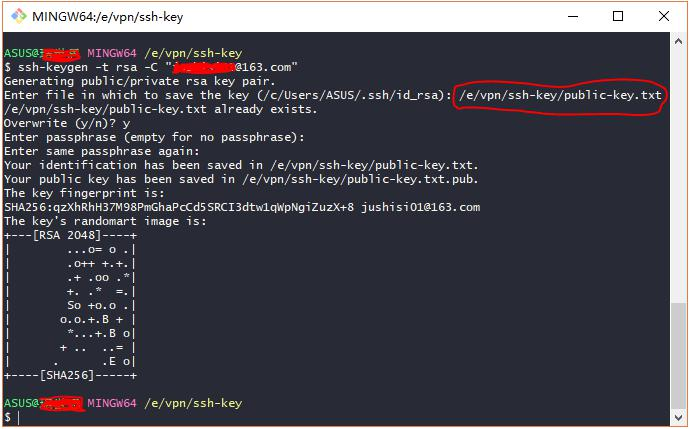
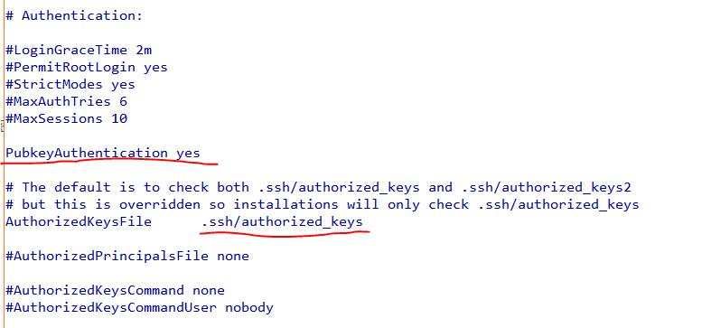

# git Bash 连接远程linux


## 准备

- 客户端
	- git bash 
- 远程服务器
	- ip 网络地址
	- username 用户名
	- passphrase 密码
	- ssh 

ssh (如果没有安装一下)
利用yum快速安装ssh

```
yum install shh

service sshd start
```

# 通过密码

```
ssh username@ip
```

举例
```
ssh root@45.16.128.214
```
然后输入密码即可


# 通过ssh


## 在本地生成密钥

>.ssh/known_hosts 如果有之前的host要删除





### 生成公钥和私钥

```
ssh-keygen -t rsa -C "xxxx@163.com"
```


之后会问生成的文件路径

```
Enter file in which to save the key (/c/Users/ASUS/.ssh/id_rsa):
```

- 如果不输入,直接回车会默认放到前用户的.ssh目录下 (C:\Users\ASUS\.ssh)
- 如果输入,需要输入linux风格的路径 ( /e/vpn/ssh-key/public-key.txt )


```
Enter passphrase (empty for no passphrase):
Enter same passphrase again:
```

之后会让你输入密码和重复密码

- 如果不想每次都输入密码,就直接回车(重复两次)
- 密码是看不见的,so 直接输入就好

在你指定的目录下会有2个文件
- id_rsa.pub 公钥
- id_rsa 私钥


### 远程主机设置公钥


- 创建目录 /root/.ssh 并设置权限

```
$ mkdir /root/.ssh
$ chmod 700 /root/.ssh
```


- 创建文件 / root/.ssh/authorized_keys并设置权限

authorized_keys 里放着公钥

```
$ vim /root/.ssh/authorized_keys
$ chmod 600 /root/.ssh/authized_keys
```

- vim 没有的话,安装一下

```
yum -y install vim*
```

[vim相关知识](http://www.runoob.com/linux/linux-vim.html)

vim 按I进入编辑模式,按esc退出到命令模式,在命令模式下输入 `:` 进行底部命令格式,
在底部命令格式下 输入 `:wq` 保持并退出

- 将id_rsa.pub中的内容复制到authorized_keys中

查看一下,是否正确
```
cat /root/.ssh/authized_keys
```


### sshd_config

有可能远程的ssh主机配置文件
有问题导致设置了ssh也会询问密码
甚至正确的密码都无法登录

vim /etc/ssh/sshd_config

/etc/ssh/ssh_host_rsa_key

将下列的内容修改为yes

```
PermitRootLogin yes
PubkeyAuthentication yes
ClientAliveCountMax 30
```



参考文章
[ssh连接linux](http://www.runoob.com/linux/linux-remote-login.html)
[远程linux](https://blog.csdn.net/zhougb3/article/details/78678135)
[root用户无法通过ssh](https://help.aliyun.com/knowledge_detail/41487.html)


## 安装和修改ss

### 安装
```
wget �Cno-check-certificate -O shadowsocks.sh https://raw.githubusercontent.com/teddysun/shadowsocks_install/master/shadowsocks.sh

chmod +x shadowsocks.sh

./shadowsocks.sh 2>&1 | tee shadowsocks.log

```


### 修改
```
vim /etc/init.d/shadowsocks restart
```

#### 单用户

```
{   "server":"0.0.0.0",
    "server_port":8088,
    "local_address":"127.0.0.1",
    "local_port":1080,
    "password":"=k1MSma7jU?e=)$5",
    "timeout":300,
    "method":"aes-256-cfb",
    "fast_open":false
}
```

#### 多用户

```
{   "server":"0.0.0.0",
     "port_password": {
        "8080":"=k1MSma7jU?e=)$5",
        "8081": "k1MSma7jU"
    },
    "local_address":"127.0.0.1",
    "local_port":1080,
    "timeout":300,
    "method":"aes-256-cfb",
    "fast_open":false
}
```

为什么git bash 不能直接密码登录?
git bash 登录还是不如putty方便..


## scp
scp source target

scp root@45.76.168.244:/etc/ssh/sshd_config  /e/vpn/ssh-key

本地Windows获取远程Linux文件，需要本地Windows有bash命令工具，执行

```
scp -P 8868 username@www.domain.com:/data/1.sh /d/data  
-P(注意P是大写)是远程ssh端口(一般默认是22)

本地传文件夹到远程Linux：
scp -rp /d/data username@www.domain.com:/data
-r 复制文件夹  -p保留原文件修改，访问时间和权限（modes）信息
```
